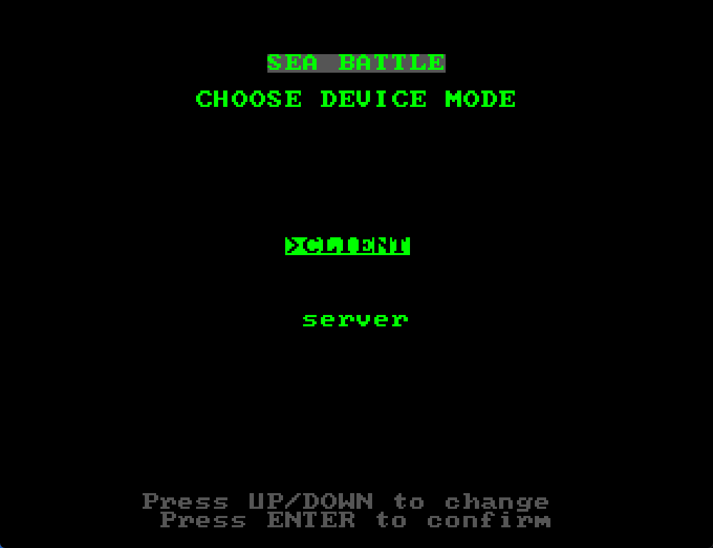
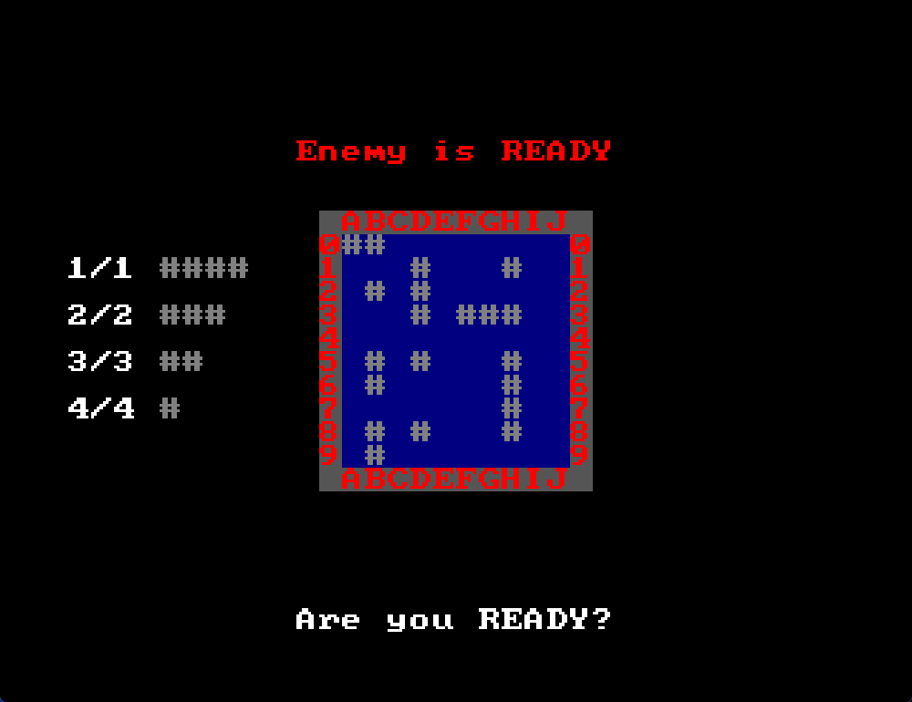
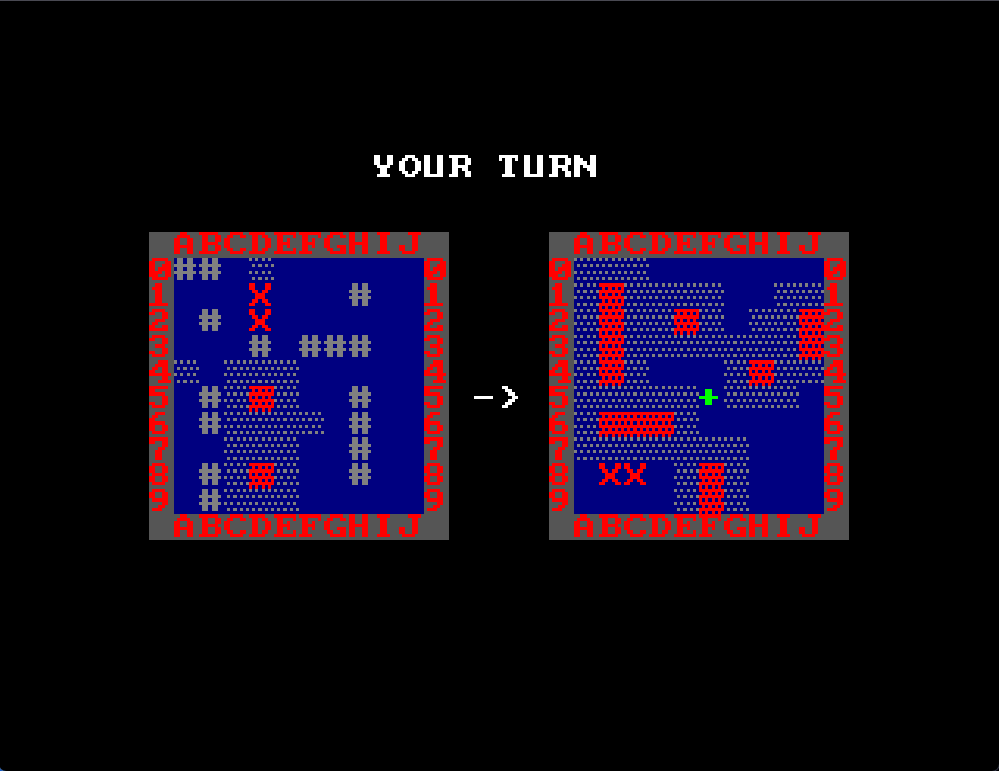
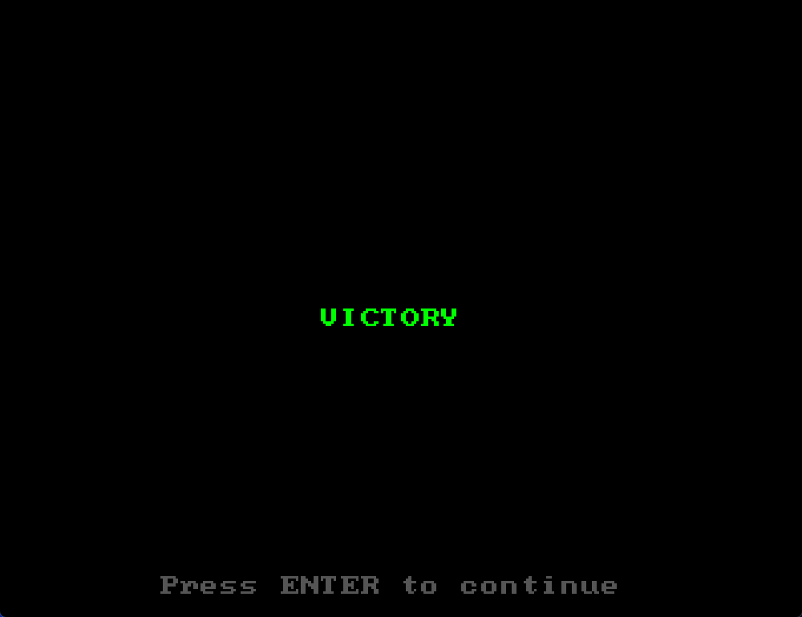

# ASM Sea Battle

Battleship game written in assembly for a custom 16-bit FPGA computer.

The project is a complete software demo for my own computer platform: it runs on a custom RISC-like CPU, draws a text-mode interface through VGA memory, reads PS/2 keyboard input, and exchanges game packets between two systems.

## Demo

### Mode Selection



### Ship Placement



### Battle



### Endgame



## Features

- full Battleship game loop
- server/client mode selection
- connection waiting state
- ship placement on a 10x10 field
- local and enemy field rendering
- keyboard-controlled cursor
- hit, miss, damaged ship, sunk ship, and endgame handling
- packet-based communication between two players

## Running In The Emulator

The repository includes the assembler and emulator binaries that were used during development.

Run these commands from the repository root:

```powershell
New-Item -ItemType Directory -Force build
.\tools\asm.exe .\src\main.asm .\build\SeaBattle.bin -rom_size 16384
.\tools\emulator\emulator.exe
```

Then open the generated ROM image in the emulator:

```text
File -> Open -> build/SeaBattle.bin
```

For a two-player session, run two emulator instances or two hardware systems connected through the platform packet interface.

## Building For FPGA ROM

The assembler can also generate Verilog-friendly ROM data:

```powershell
New-Item -ItemType Directory -Force build
.\tools\asm.exe .\src\main.asm .\build\SeaBattle.txt -rom_size 16384 -verilog
```

The generated file can be used as the program ROM contents for the FPGA computer.

## Controls

- Arrow keys: move cursor / change menu selection
- Enter: select mode, place ship, confirm action, shoot
- Q / E: choose previous or next ship size during placement
- R: rotate ship during placement
- Escape: cancel/remove during placement or leave waiting states

## Project Structure

```text
ASM-SeaBattle/
  src/
    main.asm                         Program entry point and main loop
    game/                            Game-state logic and rules
    video/                           VGA text-mode rendering routines
    keyboard/                        PS/2 keyboard state handling
    net/                             Packet send/receive macros
    sys/                             Stack, call, and memory helpers
    string/                          String routines
    globalvars/                      Memory layout, constants, game data

  tools/
    asm.exe                          Assembler for the custom CPU
    emulator/                        Emulator used for local testing

  docs/
    choose_mode.png                  Mode selection screenshot
    placing_ships.png                Ship placement screenshot
    main_game.png                    Battle screenshot
    end_game.png                     Endgame screenshot
```

## Architecture

The entry point is intentionally small:

```asm
START:
    SYS_INIT
    Game_Init
    JMP forever_loop

forever_loop:
    Game_Tick
    JMP forever_loop
```

`Game_Tick` dispatches the current game state and calls the corresponding module:

- `STATE_CHOOSE_MODE`
- `STATE_WAIT_FOR_CONNECTION`
- `STATE_PLACING_SHIPS`
- `STATE_MAIN_GAME`
- `STATE_GAME_END`
- `STATE_ERROR`

Rendering is separated into the `video/` module, keyboard polling is isolated in `keyboard/`, and communication helpers are kept in `net/`.

## Packet Protocol

Network communication is implemented through memory-mapped packet registers.

The packet structure is defined as one packet type word followed by seven data words:

```text
packet.type
packet.data[0..6]
```

The game uses packet types for connection setup, ship placement, ready state synchronization, cursor position updates, shots, shot responses, turn switching, and endgame synchronization.

The packet constants are defined in:

```text
src/globalvars/globalvars.asm
```

The send/receive macros are defined in:

```text
src/net/net.asm
```

## Platform

The target platform is a custom 16-bit computer implemented on FPGA.

The game directly uses:

- program ROM
- RAM
- VGA text buffer
- PS/2 keyboard register
- memory-mapped packet-transfer registers

## Related Projects

- [Verilog-computer](https://github.com/Pomidor1638/Verilog-computer) - FPGA computer implementation
- [RISC-Like-processor-s-assembler](https://github.com/Pomidor1638/RISC-Like-processor-s-assembler) - assembler for the custom CPU
- [CPU-Emulator](https://github.com/Pomidor1638/CPU-Emulator) - emulator/debugger used to test programs before flashing the FPGA
